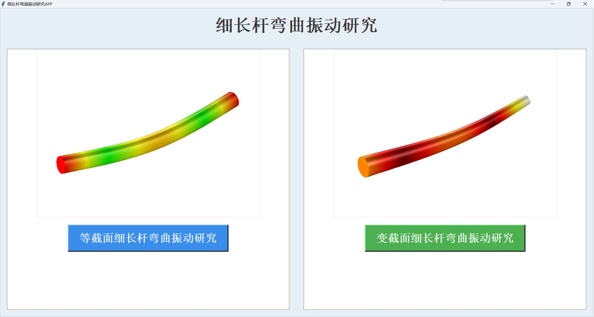
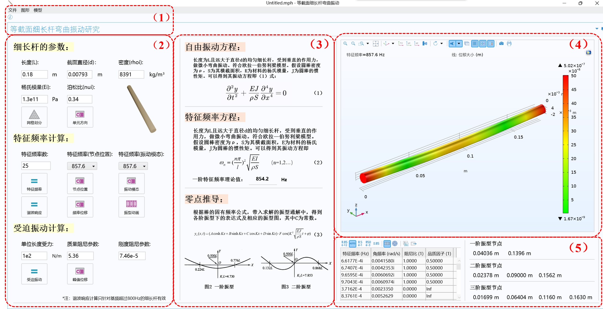
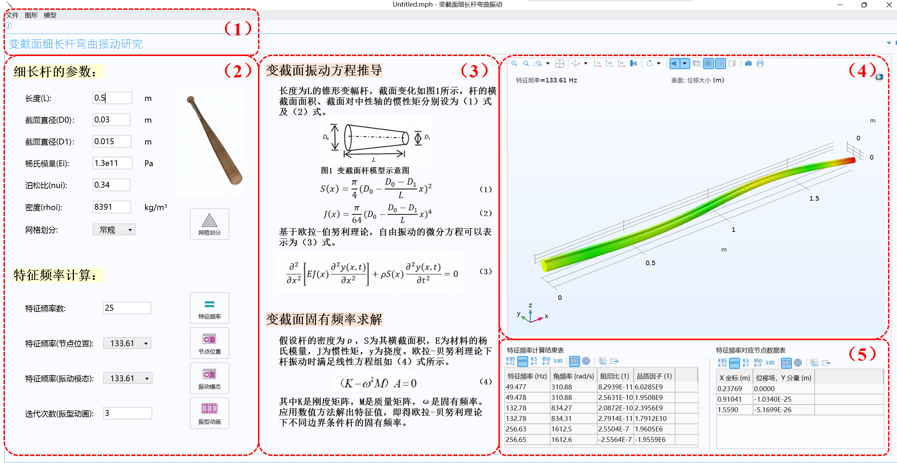
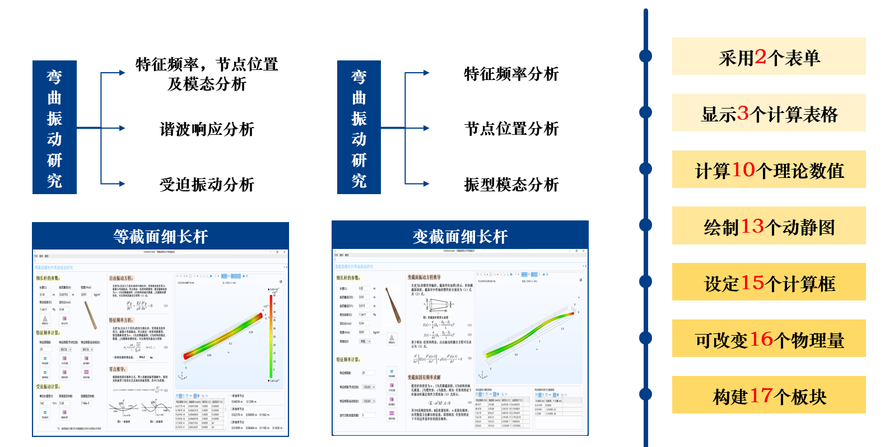
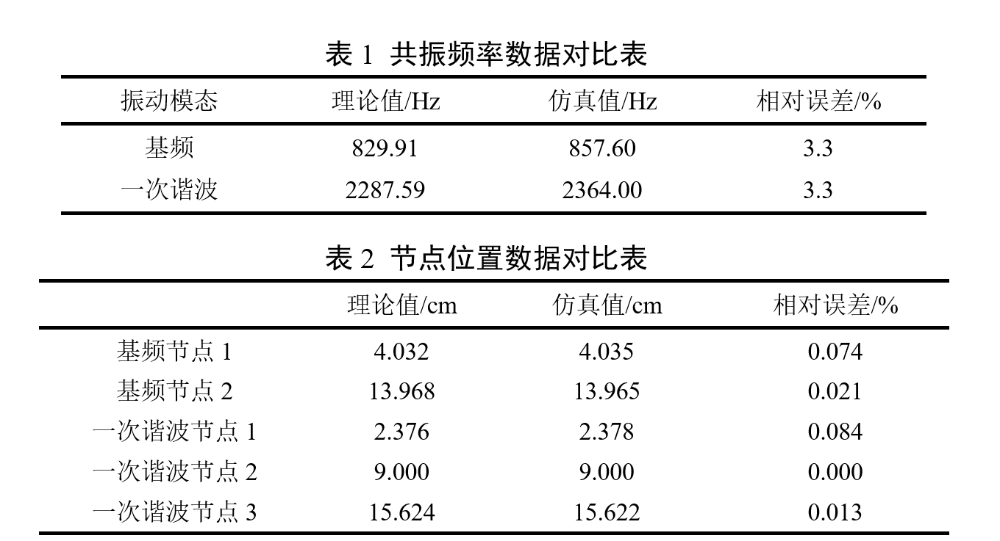

# 细长杆的弯曲振动分析系统 | Bending Vibration Analysis of Slender Rods

本项目基于 COMSOL 与 MATLAB App Designer 开发了一个用于**等截面与变截面细长杆弯曲振动分析**的软件工具，界面简洁，操作直观，功能丰富，支持多种振动工况的模拟与分析。

This project provides a software tool for **bending vibration analysis of slender rods with uniform and non-uniform cross-sections**, developed using COMSOL and MATLAB App Designer. It features a clean interface, intuitive operation, and rich functionalities supporting various vibration scenarios.

---

## 📷 软件界面 | Software Interface

### 🖼️ 主界面展示 | Main Interface Overview

- 展示了软件的主操作窗口和整体界面布局。



### 🖼️ 等截面与变截面分析界面 | Forms for Uniform and Non-Uniform Sections

- 等截面分析表单：



- 变截面分析表单：



---

## 🧩 功能结构 | Function Overview

- **总体设计图** 展现了软件功能模块划分与交互流程：



---

## 🔧 核心功能 | Core Functions

### ✅ 输入参数 | Geometry & Material Input

- 支持用户自定义输入几何参数（如长度、截面尺寸）与材料参数（如弹性模量、密度）。

### ✅ 等截面分析 | Uniform Section Analysis

- **振动模态分析**（计算不同阶次的固有频率与模态形状）  
- **节点位置输出**
- **谐波响应分析**
- **周期性强迫振动响应分析**

### ✅ 变截面分析 | Non-Uniform Section Analysis

- **振动模态分析**
- **节点位置输出**

### ✅ 误差分析 | Error Estimation

- 包括数值解与理论解的对比分析，以及误差可视化展示。



---

## 🙏 致谢 | Acknowledgements

感谢指导王龙老师的悉心指导，团队成员的通力合作。  
本项目的完成离不开大家的努力与坚持。

Thanks to the instructors for their patient guidance, and to the team members for their close collaboration.  
The successful completion of this project would not have been possible without everyone's dedication.

---

## 📁 文件结构 | File Structure

```bash
├── 提交                    # COMSOL 文件（6.2以上版本）
│   ├── 等截面细长杆弯曲振动研究.mph
│   ├── 变截面细长杆弯曲振动研究.mph
├── 说明文档                # 项目介绍以及 COMSOL 建模说明
│   ├── 说明文档.pdf
│   ├── COMSOL建模说明.pdf
├── figures/                 # 图片展示文件夹
├── README.md                # 项目说明文件

---

## 📬 注 | Note

📌 由于文件大小限制，完整版 app 无法直接上传展示，如有需要请通过主页 email 联系我。
📌 The full app cannot be uploaded here due to size limits. Please contact me via email on the homepage if you're interested.

如果这个项目对你有所帮助，欢迎点亮 ⭐Star！你的支持是我持续优化的动力！
If you find this project helpful, please consider giving it a ⭐ star — it would be greatly appreciated!
